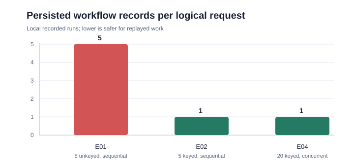

# R01 experiment comparison

| Experiment | Input condition | Primary measure | Observed result | Supported interpretation |
| --- | --- | --- | --- | --- |
| E01 | 5 sequential requests without a key | Persisted workflow records | 5 | A naive replay path duplicates work. |
| E02 | 5 sequential requests with one key | Persisted workflow records | 1 | Matching replays reuse the original workflow. |
| E03 | Workflow plus outbox event; controlled rollback | Records after rollback | 0 workflow, 0 outbox | The two records share a transaction boundary. |
| E04 | 20 concurrent requests with one key | Distinct workflow IDs | 1 | The local unique-key race path preserved one workflow. |
| E05 | Controlled dispatcher failure then retry | Outbox state | Pending after failure; published on retry | A failed controlled delivery remains retryable. |

## Reading the evidence

E01, E02, and E04 compare request replay behavior. E03 and E05 test different properties, so they are intentionally not plotted as workflow-record counts.

All runs were local and controlled. They support the narrow interpretations above, not claims about distributed systems, broker guarantees, or production-scale load.
